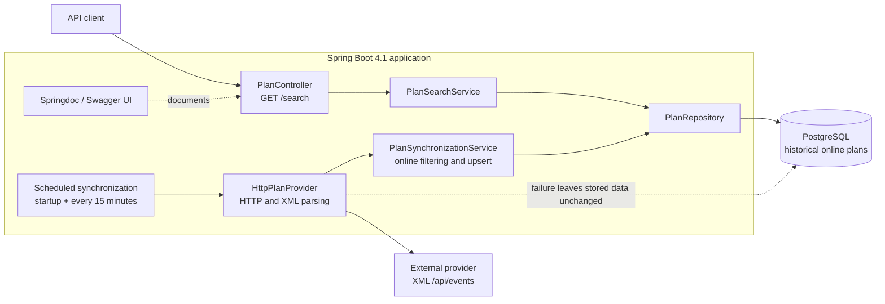
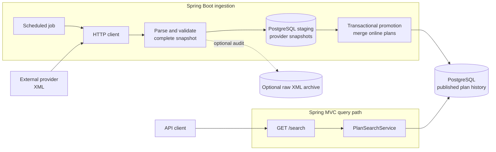
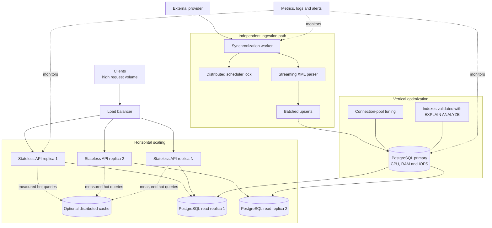

# Fever Plans

Small Spring Boot 4.1 service for the Fever provider-integration challenge. It ingests provider plans in the background, persists eligible plans in PostgreSQL, and exposes the required local search API.

## Architecture

```text
Provider XML → HttpPlanProvider → PlanSynchronizationService → PostgreSQL

Client → PlanController → PlanSearchService → PostgreSQL
```

The project uses a conventional layered Spring structure:

```text
com.fever.plans
├── api/          HTTP controller, exception handler and REST DTOs
├── service/      Search and synchronization services
├── domain/       JPA Plan model and its provider-natural PlanId
├── repository/   Spring Data JPA repository
├── provider/     External provider client and XML DTOs
└── config/       Spring configuration and externalized properties
```

This is intentionally not CQRS, DDD, or a full Hexagonal Architecture. It is a small layered application with separated ingestion and query paths. `PlanProvider` is a narrow, justified boundary around the external HTTP/XML dependency.

## Design diagrams

### Current architecture

This is the architecture implemented in the repository. Ingestion and search are deliberately
separated so that `/search` never waits for the external provider.



The key property is that provider availability affects synchronization freshness, but not the
request path or the availability of already persisted plans.

### Alternative design: staging and atomic promotion

The following is a viable alternative using the same Java, Spring Boot and PostgreSQL stack. It is
not implemented. It would be preferable if the provider integration required snapshot auditing,
reprocessing, or all-or-nothing publication.



This improves traceability and atomicity, but introduces additional schema, storage, lifecycle and
error-policy complexity. The current best-effort plan-level import is a smaller fit for the stated
requirements.

### Possible scaling evolution

This is a future production evolution, not part of the submitted implementation. Horizontal and
vertical improvements should be introduced only after measuring the actual bottleneck.



The query path is already suitable for stateless replication because application instances hold no
authoritative in-memory state. A dedicated ingestion worker and distributed scheduler lock become
relevant when more than one application instance is deployed.

## Run

Requires Docker and Docker Compose.

```bash
make run
```

If `make` is unavailable (for example on Windows):

```bash
docker compose up --build
```

The application is available at `http://localhost:8080`. Swagger UI is at:

```text
http://localhost:8080/swagger-ui/index.html
```

Stop containers with `make down` or `docker compose down`. PostgreSQL data is held in the named `postgres-data` Docker volume.

## API

```bash
curl "http://localhost:8080/search?starts_at=2021-01-01T00:00:00Z&ends_at=2022-01-01T00:00:00Z"
```

The endpoint is `GET /search`. `starts_at` and `ends_at` are optional ISO-8601 date-time query parameters. The Fever OpenAPI descriptions specify strict boundaries: a plan starts **after** `starts_at` and ends **before** `ends_at`. Therefore the query uses `starts_at > requestedStartsAt` and `ends_at < requestedEndsAt`.

The provider supplies wall-clock timestamps with no offset. Incoming API timestamps may carry an offset, but the contract does not define the provider timezone; the service deliberately compares their local date-time components instead of inventing a timezone and silently changing the meaning of provider data. A production integration must agree the provider timezone before normalizing these values to instants.

## Synchronization and history

An asynchronous initial synchronization is scheduled one second after the application starts, followed by periodic synchronization. The interval is configured as `provider.sync-delay=PT15M` in `application.properties`. Fever specifies no freshness SLA, so 15 minutes is only a configurable conservative default.

Only plans observed with `sell_mode="online"` are persisted. Existing eligible plans are updated with the latest online values from provider snapshots; plans absent from later snapshots are never deleted. If a previously stored plan later arrives as `offline`, its last online version is intentionally retained and that offline snapshot does not overwrite it.

The import is deliberately best-effort at plan level: one plan with an invalid date is skipped while other valid plans in the same XML snapshot are retained. Conversely, a failed request, timeout, HTTP error, or malformed XML prevents processing the snapshot and leaves PostgreSQL untouched. This favors availability and useful partial data; a provider contract requiring all-or-nothing snapshots would call for staging and transactional promotion.

Provider `plan_id` is not globally unique, so the natural identity is `(base_plan_id, plan_id)`. The API contract requires a UUID `id`, but the provider does not provide one. `PlanId` therefore deterministically derives a UUID from the natural identity. This gives stable API IDs across imports while preventing collisions between equal provider `plan_id` values under different base plans. With multiple providers, the provider identifier must become part of both the natural key and the UUID input.

## Database

PostgreSQL is the source of truth and runs in Compose. `schema.sql` creates the schema deterministically at startup; Hibernate runs in `validate` mode, so it validates the entity mapping rather than mutating the schema.

The `plans` table has a UUID primary key, a unique natural-key constraint on `(base_plan_id, provider_plan_id)`, and indexes on `starts_at` and `ends_at`. They are sensible initial access-path hypotheses for the two fixed predicates, not a claim of universal optimality. Validate with `EXPLAIN ANALYZE` against representative data before adding, changing, or removing indexes (including a possible composite index).

## Tests

```bash
mvn test
```

Tests cover:

- response contract and invalid request values;
- strict time boundaries;
- the Response 1 → Response 2 → Response 3 lifecycle;
- update, retention, de-duplication, offline exclusion, and preserving the last online version after an offline transition;
- provider HTTP 5xx responses and read timeouts;
- a failed scheduled synchronization while a local search still returns stored data;
- malformed online data (`2021-09-31`) not blocking other valid plans in the same snapshot.

The test suite is intentionally focused on the core business rule, the API contract, provider
failures, and the complete deployed system rather than on artificial coverage targets.

## End-to-end validation

The Playwright suite automatically validates Swagger UI availability and cases S-01 through S-07
against the running Dockerized application. It is a development-only test tool; it is not part of
the application runtime.

```bash
make e2e
```

The command starts Docker Compose in the background, waits for the API, and then runs the tests.
The suite uses Playwright as an HTTP E2E client, so it does not need a browser download. Test
reports and artifacts are ignored by Git.

## Code conventions

The code follows standard Spring conventions: constructor injection, package-private implementation
details where possible, records for immutable API/provider DTOs, focused unit tests named after
the behaviour they verify, and JavaDoc only for decisions that are not obvious from the code.
The project is formatted with standard four-space Java indentation and avoids unnecessary layers
or generated abstractions.

## Trade-offs and production evolution

Dockerized PostgreSQL provides reproducible, durable local execution and more realistic relational behavior than an embedded database. It is still an MVP: it does not include migrations, distributed scheduling/locking, batching, cache, read replicas, queues, monitoring, or resilience libraries.

For higher traffic, deploy stateless application replicas behind a load balancer; tune PostgreSQL and connection pools from measurements; add caching or read replicas only if reads become the measured bottleneck; and batch or separate ingestion if provider volumes require it. For thousands of plans with many zones, profile XML parsing and price aggregation first; streaming parsing and batched persistence are candidates only when measurements justify their added complexity.

## AI-assisted development

I used the Codex agent mainly for repository-wide code review: checking structure, imports,
dependency compatibility, edge cases, failure handling, and test coverage. I worked in small,
reviewable changes, inspected every suggestion, and reran the relevant Maven and end-to-end tests
after material modifications. AI output was never accepted without my review and validation.
